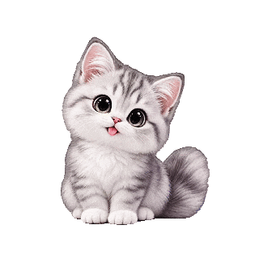
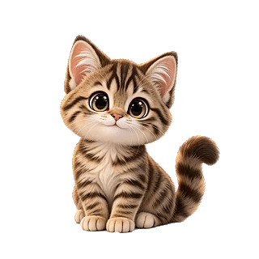
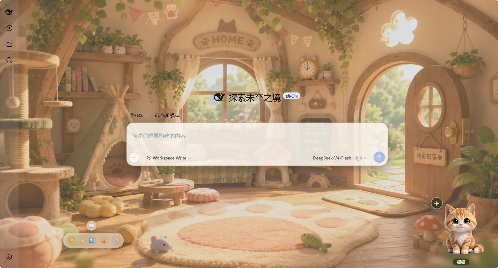
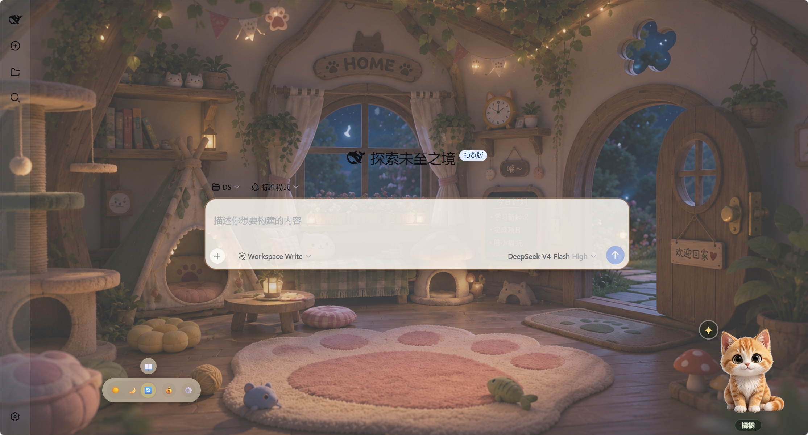
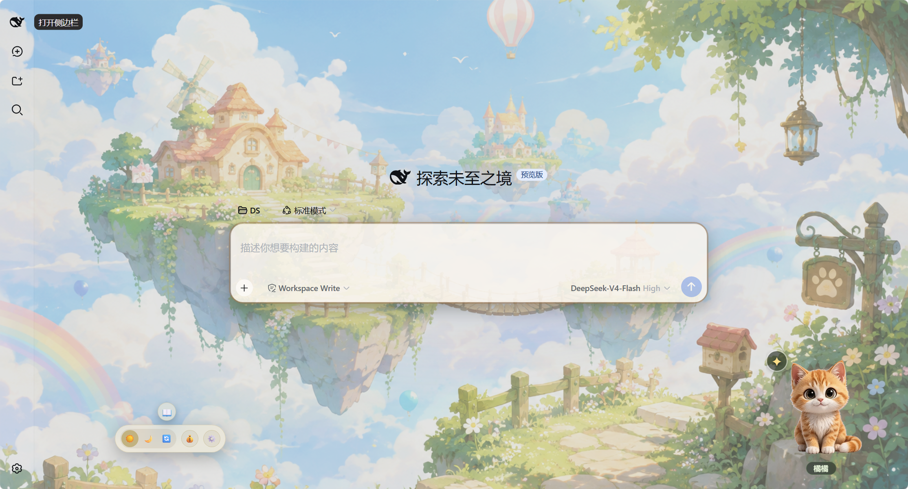
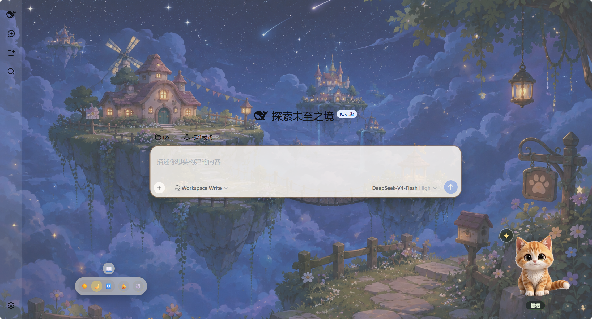

# 🐱 dsh-companion-cat · DSH 陪伴小猫

> 在 DeepSeek Harness 里养一只**会记住你们时光**的小猫：会呼吸、会撒娇、深夜催你睡觉、你烦躁时逗你开心，还会帮你盯余额、记时光、设闹钟。

---

## ✨ 小猫图鉴

<div align="center">

| | | | |
|---|---|---|---|
|  |  |  |  |
| **橘橘** 🍊 · 元气 | **奶白** 🤍 · 温柔 | **灰灰** 🌫️ · 调皮 | **乌乌** 🌙 · 神秘 |
|  |  |  |  |
| **折折** 🐾 · 乖巧 | **墨墨** 🖤 · 安静 | **绵绵** 🍮 · 软萌 | **跳跳** 🐇 · 活泼 |

</div>

- **3D 弧形展示台选猫**：小猫沿弧线排开，中间最大最亮；按键旋转、随机扫一圈礼花收尾，点「选它」才生效，名字可改
- **每只猫有专属动作**：灰灰会点击高兴、乌乌会追尾巴、跳跳会蹭手舔爪爪……点 ✦ 看技能菜单
- 点击小猫随机施展技能；每 10-15 分钟自己伸懒腰/打盹，有生活节奏
- 拖动小猫放到屏幕任何位置（它记住）
- 🚧 **开发中**：小猫动作还在持续补充完善，后续会为每只猫猫增加更多动作

---

## 🏡 多背景壁纸

<div align="center">
  　
  <br><sub>猫猫屋 · 白天 / 夜晚（自动切换）</sub>
</div>

<div align="center">
  　
  <br><sub>天空屋 · 白天 / 夜晚（自动切换）</sub>
</div>

- **多背景选择**：设置 → 背景壁纸 → 3D 弧形展示台挑选（蘑菇屋、猫猫屋、天空屋、小木屋…持续补充），每套自动白天/黑夜切换
- **白天 / 黑夜 / 自适应**三种模式：固定"白天"或"黑夜"，或**自适应**——早上 6 点切白天、晚上 7 点切黑夜
- 透明度滑条调节背景蒙版，**文字永远清晰**
- 消息气泡、思考块、工具调用卡、输入框、统计条都自动加幕布，跟背景呼应

---

## 🎯 它有什么本事

### 📖 我们的时光 · 记忆系统
**最特别的地方——一只"记得你"的猫：**

> 🚧 **开发中**：记忆功能还在测试完善中，提炼规则、问答效果会持续调整，欢迎反馈~

- **第一次相遇**：选中它的那一刻自动记入时光
- **里程碑**：认识 7/30/100/365 天、累计陪伴 100/1000 小时 → 小猫主动庆祝
- **自动记忆提炼**（深度陪伴开启）：下次打开页面，自动把上次会话总结成记忆（项目进展、加班到几点、心情、习惯）——只提炼你新聊的，宁缺毋滥
- **记忆档案**：按天分组的牛皮纸日记，透明查看猫记了你哪些东西
- **问问它**：问"还记得我们第一次见面吗？"——基于**真实记忆**回答，不知道就说记不清（防幻觉），每次回答带它的性格

### 💰 余额小管家
- 工具栏 💰 一键查 DeepSeek API 余额（key 不出服务端）
- 余额紧张时反复提醒，气泡带**「去充值 ↗」**直达官方充值页
- 检查频率随余额自适应（≥20 元 30 分钟 / <5 元 3 分钟 / <1 元 45 秒），充值回血自动消停

### 📊 今日统计
- 活跃在线时长（只有真正操作 DSH 才算，空闲 2 分钟暂停）+ 对话轮数 + 按 token 细分的花费
- 花费走官方余额差值口径，不是估算；次日首次打开小猫汇报昨日战绩
- 近 7 天面板（图表数据修复中，按钮暂置灰）

### ⏰ 时间管家
- **闹钟**：任意多条，到点气泡 + 庆祝 + 叮咚音效，每天重复
- **久坐休息**：每满 45 分钟（可调）提醒活动
- **深夜提醒**：23:00–5:00 打盹催睡，每天一次

### 💬 会关心你的小猫
- **情绪感知**：输入"烦死了/崩溃" → 吓一跳再安慰你；"太棒/谢谢" → 陪你开心
- **智能陪伴**（默认开，零 token）：记住你的作息/习惯，深夜提醒个性化（"你最近都熬到这么晚"）
- **深度陪伴**（可选开关，默认关）：AI 生成个性化问候 + 💌 记忆对话（每日预算内，用多少花多少）

---

## 📦 安装

### 方式 1：npm 一行命令（推荐）

已发布到 npm，直接安装（纯静态、无需构建）：

```bash
dsh plugin --profile web add dsh-companion-cat
```

重启 `dsh web` 即生效，以后更新：

```bash
dsh plugin --profile web update dsh-companion-cat
```

### 方式 2：GitHub 仓库直接安装

把仓库地址"发给 dsh"即可自动安装：

```bash
dsh plugin --profile web add github:Buhuang0828/dsh-companion-cat
```

### 方式 3：下载 ZIP + 本地目录安装

1. GitHub 点 **Code → Download ZIP**，解压到任意目录
2. 在 DSH profile 目录下执行：

```bash
cd $DSH_HOME/profiles/web        # Windows: C:\Users\<你>\.dsh\profiles\web
dsh plugin --profile web add ./dsh-companion-cat   # 指向解压的文件夹
```

> 💡 **注意**：余额/token/记忆对话等 node 半功能**必须重启 `dsh web`**；纯前端改动（动画、壁纸）刷新即可。

---

## 🛠️ 玩法速查

| 操作 | 效果 |
|---|---|
| 单击小猫 | 随机技能 |
| 点 ✦ | 技能菜单（按猫过滤）|
| 拖动小猫 | 换个位置（记住）|
| 双击小猫 | 设置面板 |
| 💰 / ⚙️ | 查余额 / 设置 |
| 📖 时光 | 我们的时光（时间线 + 问猫）|
| 设置 → 请选择你的小猫 | 3D 弧形选猫 + 改名 |
| 设置 → ⏰ 闹钟 | 添加/开关/删除闹钟 |

---

## 🧠 原理：两半架构 + 分层成本

| 半 | 文件 | 职责 | token |
|---|---|---|---|
| node 半 | `lib/index.js` | 静态资源、余额代理（key 不出服务端）、token/会话统计、Agent LLM 调用 | 仅 Agent 功能 |
| browser 半 | `lib/client.js` | 小猫 UI、全部交互、记忆库、统计、事件采集 | 不调用 LLM |

- **零 token**：陪伴动画、提醒、闹钟、统计、记忆采集、时间线、随机选猫——全部本地规则
- **可选少量 token**（深度陪伴开关控制）：AI 问候（5 次/天）、记忆对话（10 次/天）、自动记忆提炼（每天 1 次）
- **隐私**：只提炼**你自己输入**的内容，记忆只存本地 localStorage

---

## 🗂️ 项目结构

```
dsh-companion-cat/
├── package.json          # dsh.client 声明（platform: web）
├── assets/
│   ├── background-*.jpg/png  # 各套背景（蘑菇屋 / 猫猫屋 / 天空屋 / 小木屋，白天+夜晚）
│   ├── background-live.mp4   # 自适应动态背景（8s = 一天）
│   ├── showcase-*.png        # README 展示图
│   ├── paper-kraft.png       # 记忆面板的牛皮纸背景（透明）
│   └── cats/                 # 每只猫一个文件夹（8 只）
├── lib/
│   ├── index.js          # node 半：静态路由 + balance/tokens/sessions/memory API
│   └── client.js         # 浏览器半：小猫 + 记忆 + 统计 + 全部功能
└── test/                 # 单元测试（node:test，零依赖）
```

🚧 **想加一只新猫？** 目前手动加猫需要：把透明 GIF 放进 `assets/cats/<name>/`（命名 `idle.gif`、`happy.gif`…），并在 `lib/client.js` 的 `CATS` 表配置动作/尺寸/性格。**「配置化加猫」功能待开发**——后续会支持免改代码添加新猫。

---

## 📄 License

- **代码**：MIT（见 [LICENSE](./LICENSE)）
- **小猫图片/动图、背景图**（`assets/`）：AI 生成资源，**可以自由使用，但不可商用、不可二次分发**

---

**Made with 🧡 and a lot of 🐾** · 给 DeepSeek Harness 一点陪伴的温度
