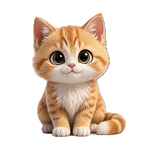
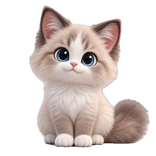
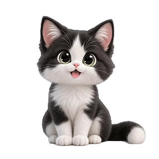
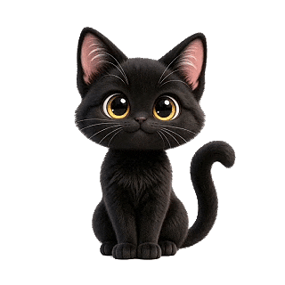

# 🐱 dsh-companion-cat · DSH 陪伴小猫

> **请选择你的小猫！** 在 DeepSeek Harness 里，养一只会呼吸、会撒娇、会提醒你休息、会帮你盯余额、**会记住你们时光**的小猫。

一只住在你工作台里的小猫。它会呼吸、伸懒腰、深夜催你睡觉、你烦躁时逗你开心——**还会帮你查 API 余额、设闹钟、记录使用统计，甚至记住你们一起做过的事**。核心陪伴**零 token**；可选开启「深度陪伴」后，它能用 AI 跟你聊天、回忆你们的时光（消耗极少量 token）。

---

## ✨ 它有什么本事

### 🐾 小猫图鉴

<div align="center">

| | | |
|---|---|---|
|  |  |  |
| **橘橘** 🍊 · 元气 | **奶白** 🤍 · 温柔 | **灰灰** 🌫️ · 调皮 |
|  |  |  |
| **乌乌** 🌙 · 神秘 | **折折** 🐾 · 乖巧 | **墨墨** 🖤 · 安静 |

*（都是完整待机动画的动态 GIF，动作连贯）*

</div>

打开「请选择你的小猫」是一个**3D 弧形展示台**：

- 小猫沿**半圆弧**排开，中间最大最亮、两侧变小变淡（VR 展示柜 feel）
- **◀ ▶ 按键** / 鼠标旋转阵列 / 点小猫快速转过来
- **🎲 随机选一只**：猫排左右蛇形扫过一整圈，停住时**礼花绽放**再亮出 ✓ 徽标——仪式感拉满
- 停在中央的猫带柔光；已确认的猫**头顶有金色 ✓ 徽标**
- 点「✓ 选它」才生效——浏览别的猫不会误改选择
- 名字旁 **✎** 可改名（名字贴在猫脚下）

### 🎬 会表演的小猫
- **点击小猫** → 随机施展技能（开心跳、伸懒腰、惊吓、打盹……）
- **左上角 ✦** → 技能菜单，点它表演
- 墨墨被点击会优先表演「点击高兴」
- 每 10-15 分钟它自己伸个懒腰/打个盹，有生活节奏
- 拖动小猫放到屏幕任何位置（记忆位置）

### 📖 我们的时光 · 记忆系统 ⭐
**这是它最特别的地方——一只"记得你"的猫：**

- **🌱 第一次相遇**：你选中它的那一刻，自动记入时光（"那天你挑选了很久，最后把我选中了"）
- **⭐ 里程碑自动采集**：认识 7/30/100/365 天、累计陪伴 100/1000 小时 → 小猫主动庆祝
- **📁 工作记录**：自动同步 DSH 会话标题（你最近在做什么）
- **✨ 自动记忆提炼**（深度陪伴开启时）：下次打开页面时，自动把上次会话聊的内容总结成记忆（项目进展、加班到几点、心情、习惯）——**只提炼你新聊的，历史消息不动，宁缺毋滥**
- **✉️ 记忆档案**：按天分组的紧凑记忆列表，透明查看猫记了你哪些东西
- **💌 问问它**：问"还记得我们第一次见面吗？""你觉得我最近怎么样？"——它基于**真实记忆数据**回答（防幻觉：记忆片段注入，不知道就说记不清），每次回答都带它的性格

```
📖 时光                              ✉️ 记忆
🌱 第一次相遇          →          2026-08-24
⭐ 认识 7 天啦                      📁 工作记录  重构登录模块
📁 工作记录  数据面板                📝 深夜工作  改插件到凌晨
```

### 💰 余额小管家
- 工具栏 **💰** 一键查询 DeepSeek **API 余额**（官方接口，key 不出服务端）
- **低余额反复提醒**：<5 元每 15 分钟、<3 元每 20 分钟、<1 元每 10 分钟（橙红警示气泡 + 小猫失落 + 30 秒停留）
- **检查频率随余额自适应**：≥20 元 30 分钟 / 5~20 元 15 分钟 / 1~5 元 3 分钟 / <1 元 45 秒
- 充值回 5 元以上自动重置提醒

### 📊 数据面板
- **今日统计**：活跃在线时长（只有你真正操作 DSH 才算，空闲 2 分钟暂停）+ 对话轮数（快照计数，不虚增）+ 按 token 细分的花费
- **近 7 天面板**：KPI 指标卡（总时长/轮数/Token/花费）+ 每日柱状图/折线图（带数值）+ **会话花费排行**（哪个会话最烧钱）
- **花费官方口径**：通过余额差值记录真实消耗（和 DeepSeek 官方一致），不是估算
- 次日首次打开小猫汇报昨日战绩

### ⏰ 时间管家
- **闹钟**：任意多条（时间 + 名称），到点气泡 + 庆祝动画 + **叮咚音效**，每天重复
- **久坐休息**：每满 45 分钟（可调）提醒起来活动
- **深夜提醒**：23:00–5:00 打盹催睡，每天一次

### 🌲 融入背景的壁纸
- **白天 / 黑夜 / 自适应**三种模式（自适应 = 动态视频，随时间变化）
- 透明度滑条调节背景蒙版，**文字永远清晰**
- 消息气泡、思考块、**工具调用卡（Edit/bash 等）**、输入框、统计条都自动加幕布，跟背景呼应

### 💬 会关心你的小猫
- **情绪感知**：输入框里出现"烦死了 / 气死 / 崩溃" → 猫吓一跳再安慰你；"开心 / 太棒" → 陪你开心（支持感叹号加权）
- **智能陪伴**（默认开，零 token）：记住你的作息/习惯，深夜提醒个性化（"你最近都熬到这么晚"）
- **深度陪伴**（可选开关，耗少量 token）：Agent 用 AI 生成个性化问候 + 记忆对话

---

## 🧠 原理：两半架构 + 分层成本

| 半 | 文件 | 职责 | token |
|---|---|---|---|
| node 半 | `lib/index.js` | 静态资源、余额代理（key 不出服务端）、token/会话统计、Agent LLM 调用 | 仅 Agent 功能 |
| browser 半 | `lib/client.js` | 小猫 UI、全部交互、记忆库、统计、事件采集 | 不调用 LLM |

**成本分层（对你透明的设计）**：
- **零 token**：陪伴动画、提醒、闹钟、统计、记忆采集、时间线、随机选猫——全部本地规则
- **可选少量 token**（「深度陪伴」开关控制）：
  - AI 个性化问候（每日预算 5 次）
  - 💌 记忆对话（每日预算 10 次）
  - 自动记忆提炼（每天最多 1 次，每次几百 token）
- **隐私**：只提炼**你自己输入**的内容，不读 assistant 回复；记忆只存本地 localStorage

---

## 📦 安装

```bash
# 在 profile 目录下安装
dsh plugin --profile web add dsh-companion-cat
```

或者在 `$DSH_HOME/profiles/web/cordis.patch.yml` 中加入：

```yaml
- insert:
    - id: dsh-companion-cat
      name: dsh-companion-cat
```

重启 `dsh web`，刷新页面，小猫就来了。（余额/token/Agent 功能需要 node 半生效，务必重启一次。）

---

## 🗂️ 项目结构

```
dsh-companion-cat/
├── package.json          # dsh.client 声明（platform: web）
├── assets/
│   ├── background-day.png    # 白天背景
│   ├── background-night.png  # 夜晚背景
│   ├── background-live.mp4   # 自适应动态背景（8s = 一天）
│   └── cats/                 # 每只猫一个文件夹
│       ├── fold/             # 折折（待机+开心跳）
│       ├── gray/             # 灰灰（待机）
│       ├── orange/           # 橘橘（全套动作）
│       ├── white/            # 奶白（待机）
│       ├── dark/             # 乌乌（待机）
│       └── black/            # 墨墨（9 个动作，含点击高兴）
└── lib/
    ├── index.js          # node 半：静态路由 + balance/tokens/sessions/memory-chat/extract-memory API
    └── client.js         # 浏览器半：小猫本体 + 记忆系统 + 统计 + 全部功能
```

**想加一只新猫？** 把它的透明 GIF 放进 `assets/cats/<name>/`（命名 `idle.gif`、`happy.gif`…），再在 `lib/client.js` 的 `CATS` 表里加一行（名字、气泡色、性格 persona）即可；缺失的动作自动回退到待机。

---

## 🛠️ 玩法速查

| 操作 | 效果 |
|---|---|
| 单击小猫 | 随机技能（墨墨优先"点击高兴"）|
| 点 ✦ | 打开技能菜单 |
| 拖动小猫 | 换个位置（记忆位置）|
| 双击小猫 | 打开设置面板 |
| 工具栏 ◐ / 💰 / ⚙️ | 背景模式 / 查余额 / 设置 |
| 📖 时光按钮（工具栏下） | 我们的时光（时间线）|
| 时光 → ✉️ 记忆 | 记忆档案（按天分组）+ 💌 问猫 |
| 设置 → 请选择你的小猫 | 3D 弧形选猫 + 🎲 随机 + ✓ 确认 + ✎ 改名 |
| 设置 → ⏰ 闹钟 | 添加/开关/删除闹钟 |
| 设置 → 陪伴提醒 | 深夜/情绪/久坐/智能陪伴 |
| 设置 → 深度陪伴(AI) | 开启 AI 问候 / 💌 记忆对话 / 自动记忆提炼 |

---

## 📄 License

MIT

---

**Made with 🧡 and a lot of 🐾** · 给 DeepSeek Harness 一点陪伴的温度
